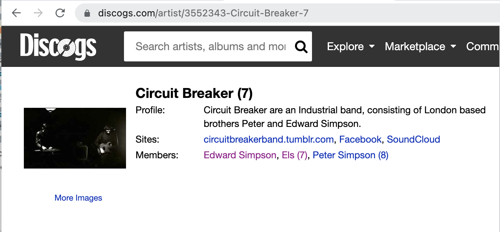
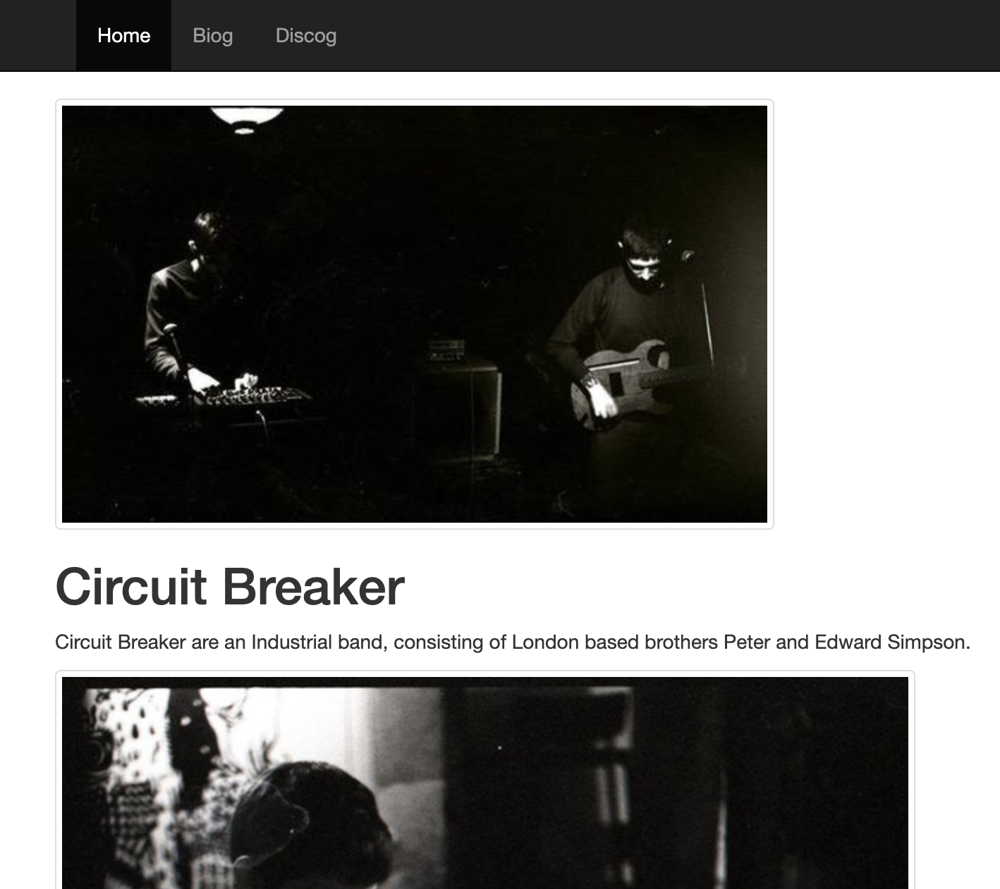

## Discogs Puller 
A POC for an *'admin-less'* band portfolio site. 
Pulls all the required info from the [discogs.com](https://discogs.com/developers) API 

## Motivation
I wanted to explore some of the
latest-and-greatest trends that everyone seems to be excited about in Python Web Dev, so thought I'd build out yet
another implementation of a musical artist portfolio site, as thats something I might potentially use one day.  

 - Baked Data
   - [Simon Willison](https://twitter.com/simonw) has been tweeting about this approach for a while now.
     His [*official* definition](https://simonwillison.net/2021/Jul/28/baked-data/) is as follows: '...
   bundling a read-only copy of your data alongside the code for your application, as part of the same deployment'. 
     Thats not *quite* what im doing here, but there is a script which gets run when the container image is built,
    which will create a SQLite database using data pulled down from the Discogs service. 
   
 - ASGI: 
   - My journey in the Python web world thus far,has been very focused on WSGI. After having done some [Asyncio 
   brushing up](https://github.com/pj-simpson/async-reference), I wanted to get to grips with one of
   the many ASGI frameworks. 
   I saw [Starlite](https://starlite-api.github.io/starlite/) author Na'aman Hirschfeld 's [blogpost](https://itnext.io/introducing-starlite-3928adaa19ae) 
   about the project and found his reasoning behind some of the API decisions very compelling. 
   
 - Repository Pattern
   - The [example Starlite app](https://github.com/starlite-api/starlite-pg-redis-docker) 
   seems to use the repository pattern, so I did some
   reading up on that. There is an excellent introductory chapter in the book [Cosmic Python](https://www.cosmicpython.com/book/chapter_02_repository.html)
   by Harry Percival and Bob Gregory
   
 - Fly
   - The demise of Heroku's free tier means that people have their eye on the upcoming PAAS
     providers. I have heard lots of good things about [Fly.io](https://fly.io/) 
 - Github Actions
   - Everyone seems to use Github actions nowadays so I figured it was time
     to give it a go! Here, actions runs some tests then pushes the image to be deployed.
   

